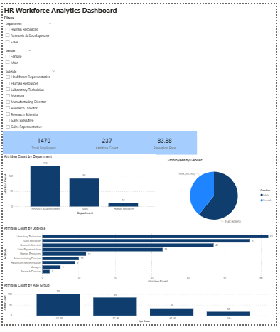

# HR-Workforce-Analytics-PowerBI
This project analyzes employee attrition and workforce trends using Power BI.

## Dashboard Insights
- Total Employees
- Attrition Count
- Retention Rate
- Attrition by Department
- Attrition by Job Role
- Attrition by Age Group
- Gender Distribution

## Dashboard Preview

## Tools Used
- Power BI
- DAX
- Data Visualization

  ## Dataset
   HR Employee Attrition dataset.

  ## Dashboard Features
  Interactive filters:
- Department
- Gender
- Job Role
